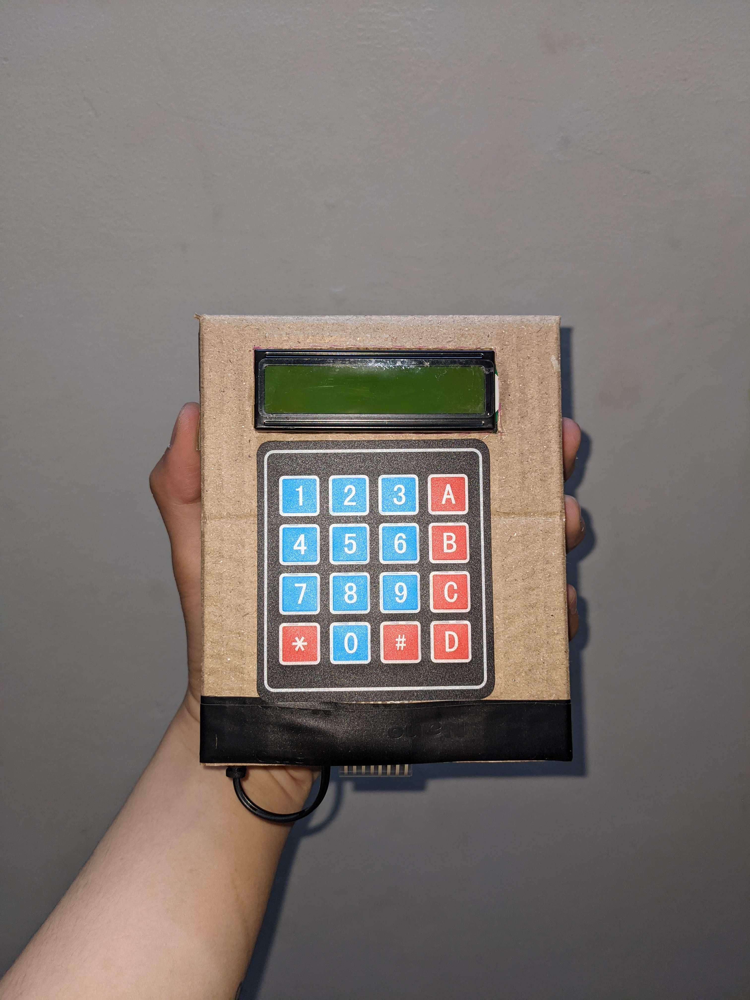

# Pocket Calculator with Arduino 🧮

## About the Project
This is an academic project for the "Pocket Calculator Design" course at the Faculty of Electrical and Electronic Engineering, Hanoi Open University. The project simulates and builds a standalone handheld calculator based on the open-source Arduino platform. It accurately processes basic mathematical operations following standard operator precedence (multiplication/division before addition/subtraction) using the Shunting-yard algorithm and Reverse Polish Notation (RPN).

## Key Features
* **Accurate Mathematics:** Performs 4 basic operations (+, -, *, /) on floating-point numbers, automatically recognizing operator precedence without needing parentheses.
* **Smart Operator Override:** Automatically replaces the old operator if the user accidentally inputs two operators consecutively, preventing infinite loops and system crashes.
* **History Memory (ANS):** Automatically saves the last 5 successful calculations and allows users to recall past results for continuous calculations.
* **Hardware Protection & Error Trapping:** Features a 7-digit input limit, alerts for memory overflow (`ovf`), and traps division-by-zero errors.

## Hardware Components
* **Microcontroller:** Arduino Uno R3 Board featuring the ATmega328P 8-bit chip.
* **Display:** 16x2 Liquid Crystal Display (LCD).
* **I/O Expander:** PCF8574 I2C module for the LCD display.
* **Input Device:** 4x4 Matrix Membrane Keypad (16 keys).
* **Power Supply:** Standalone 9V battery with a DC connector.

## Hardware Pinout
The system uses an I2C module to optimize the Arduino's pin usage. The pin mapping is configured as follows:

| Peripheral Device | Signal Pin | Arduino Uno Pin | Function |
| :--- | :--- | :--- | :--- |
| **LCD 16x2 + I2C** | SDA | A4 | Serial Data |
| | SCL | A5 | Serial Clock |
| | VCC / GND | 5V / GND | Power Supply |
| **Keypad 4x4** | Rows (1-4) | D7, D6, D5, D4 | Matrix Row Scanning |
| | Cols (1-4) | D8, D9, D10, D11 | Matrix Column Reading |

## Software Architecture & Algorithm
The source code is written in `C++` using the Arduino IDE. The core logic relies on:
* **Stack Data Structure:** Uses the `LIFO` (Last In, First Out) principle to manage separate arrays for numbers (`float numbers`) and operators (`char operators`).
* **Reverse Polish Notation (RPN):** Evaluates the weight of mathematical operations (multiply/divide = 2, add/subtract = 1) to determine whether to execute the calculation immediately or push the data onto the stack.

## Installation & Compilation
1. Clone this repository to your local machine.
2. Open the `.ino` file using the **Arduino IDE**.
3. Install the required open-source libraries via the *Library Manager*:
   * `Keypad.h`
   * `LiquidCrystal_I2C.h`
   * `Wire.h` (Built-in)
4. Connect the Arduino Uno via a USB cable, select the `Arduino Uno` board, and choose the corresponding `COM` port.
5. Click **Upload** to flash the program to the microcontroller.

## Development Team
* **Phan Văn Đức**
